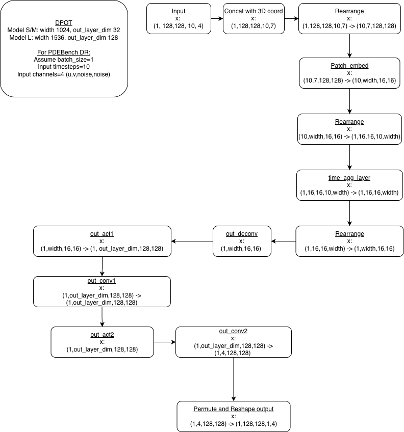

# Summary for DPOT
Relatively simple model to work with. Pretrained weights can be downloaded from DPOT's Github.

General pipeline: Preprocess data using DPOT's script -> Run inference using DPOT's script (evaluate.py)

For reference, check the notebooks in this folder.

## Notes
Remember to change file paths in make_master_file.py.

evaluate.py scripts include custom plotting code, which were not included in DPOT's original evaluate.py script. The animation/plotting blocks are indicated by comments.

For Macbook users, it is important to set num_workers=0 for the train/test loaders in evaluate.py as seen below:

```python
    # train_loader = torch.utils.data.DataLoader(train_dataset, batch_size=args.batch_size, shuffle=True, num_workers=8)
    train_loader = torch.utils.data.DataLoader(train_dataset, batch_size=args.batch_size, shuffle=True, num_workers=0)
    # test_loaders = [torch.utils.data.DataLoader(test_dataset, batch_size=args.batch_size, shuffle=False,num_workers=8) for test_dataset in test_datasets]
    test_loaders = [torch.utils.data.DataLoader(test_dataset, batch_size=args.batch_size, shuffle=False,num_workers=0) for test_dataset in test_datasets]
```

## debug.py
Primary use of this script is to debug the model, though it can be used for inference testing as well.

For Model S, use debug.py as it is.

For Model M, arguments to add are:
```python
    "--n_layers", "12", 
    "--mlp_ratio", "4", 
```

For Model L, arguments to add are:
```python
    "--out_layer_dim", "128", 
    "--width", "1536", 
    "--n_layers", "24", 
    "--data_weights", "8", "2", "8", "1", "1", "1", "1", "15", "20", "1", "3", "1", 
    "--n_blocks", "16", 
    "--mlp_ratio", "4", 
```

The respective arguments above are taken from either the configs or the default/commented out arguments in evaluate.py.

## evaluate.py VS evaluate_unknown.py
Dataset used: PDEBench 2D Diffusion-Reaction

evaluate.py: Works autoregressively, i.e. takes t0-9 as input to predict t10, before sliding 1 frame forward, taking t1-10 to predict t11, till t100. It is unable to go beyond this timestep, since PDB DR only has 101 timesteps.

evaluate_unknown.py: 

The goal of this script is to predict timesteps 101-110, i.e. the next 10 timesteps with no ground truth/reference.

From evaluate_unknown.py:

```python
            N_EXTRAP = 10
            extrap_preds = [] 
            extrap_xx = yy[..., -args.T_in:, :] # Use ground truth t=91-100 (real)
            print(f'extrap_xx seeded with real GT: {extrap_xx.shape}')

            #Feed t91-100 into model for autoregressive prediction
            for step in range(N_EXTRAP):
                im_ext, _ = model(extrap_xx)
                extrap_preds.append(im_ext)
                extrap_xx = torch.cat((extrap_xx[..., args.T_bundle:, :], im_ext), dim=-2)
                print(f'  [Extrap] t={101 + step} | extrap_xx: {extrap_xx.shape}')
            extrap_pred = torch.cat(extrap_preds, dim=-2)
            extrap_np = extrap_pred.squeeze(0).cpu().numpy()  # (128, 128, N_EXTRAP, 4)
```

We take the last 10 time steps from yy (ground truth), before autoregressively predicting t101-110 in the following loop.

The same sliding window used for evaluate.py is also used in the loop here.

## DPOT Forward pass
From models/dpot/DPOTNet forward pass (lines 364-403).

The image below illustrates the shape changes of the input for a single forward pass in the code block mentioned above. 
For 1 sample of PDEBench's DR, there are 91 forward passes, since there are 91 predictions, and 10 initial input frames (101 timesteps total)




## Pseudo Inverse

For Macbook users, it is recommended to switch to machines that have a dedicated GPU/Google Colab to run DPOT with the pseudo-inverse function. Most of the variables are of type float64, which MPS does not support.
If you still wish to run the model on a Macbook, do use the CPU version of the code blocks. This is highly not recommended, as inference would take extremely long (30 mins to many hours), depending on model size used.

Addition of Pseudo-inverse function (lines 493-902) of dpot.py/DPOTNet/forward

```python
        # pseudo-inverse
    
        ## --- START OF LAYERS ---
        x = self.out_deconv(x) #S/M: (1,1024,16,16), L: (1,1536,16,16)

        x = self.out_act1(x) #S/M: (1,32,128,128), L: (1,128,128,128)

        x = self.out_conv1(x) #S/M: (1,32,128,128), L: (1,128,128,128)

        x = self.out_act2(x) #S/M: (1,32,128,128), L: (1,128,128,128)

        x, ssr = CNN_PINN_Pseudo_Inverse_2D_DR_NeumannBC(x, inputs0)
        # x = self.out_conv2(x) #S/M: (1,32,128,128) -> (1,4,128,128), L: (1,128,128,128) -> (1,4,128,128)
        
        ## --- END OF LAYERS ---

        
        # x, ssr = CNN_PINN_Pseudo_Inverse_2D_DR_NeumannBC(x, inputs0)

        ones = torch.ones(x.shape[0], 2, x.shape[2], x.shape[3], device=x.device, dtype=x.dtype) # noise becomes all ones here
        x = torch.cat([x, ones], dim=1)

        x = x.permute(0, 2, 3, 1)

        x = x.reshape(*x.shape[:3], self.out_timesteps, self.out_channels).contiguous() # (1,128,128,4) -> (1,128,128,1,4)

        if self.normalize:
            x = x * sigma  + mu

        return x, cls_pred
```

Having the pseudo-inverse function after self.out_act2 gives better results compared to having it after self.out_conv2.

Placing the pseudo-inverse function after any other functions besides the 2 mentioned above would give significantly worse results.

If you wish to test other positions for the pseudo-inverse function, ensure that any other layers AFTER the pseudo-inverse function is commented out.

If the pseudo-inverse function is located after self.out_conv2, there is no need to comment out any of the layers above.

### Kernel/Reg term/Nonlinear terms
Located in dpot.py/CNN_PINN_Pseudo_Inverse_2D_DR_NeumannBC

```python
def CNN_PINN_Pseudo_Inverse_2D_DR_NeumannBC(inputs, inputs0):
    ...
    n_kernel_size = 5  #Parameter, values 3/5/7   (line 497)
    ...
    # reg = 1e-1  # kernel 3   (lines 594-599)
    reg = 1  # kernel 5
    # reg = 75 # kernel 7
    ...
    # iteration to calculate the nonlinear term
    # Number of nonlinear terms can be changed
    # Values 3/4/5, to test for optimal results
    for i in np.arange(3):    #(line 762)
    ...
```

As per the comments, values for kernel size and reg terms should correspond when being tuned.

Number of nonlinear terms is independent of kernel size and reg term. It should be noted that when testing values of 3/4/5, there are no significant changes in results.


### Important edits
Located in dpot.py/CNN_PINN_Pseudo_Inverse_2D_DR_NeumannBC

Lines 555-581

```python
    ## BEFORE
    # inputs_np = inputs.detach().cpu().numpy()

    # M_u = np.zeros((inputs_conv2d.shape[0]*inputs_conv2d.shape[2]*inputs_conv2d.shape[3], inputs_conv2d.shape[1]*n_kernel_size*n_kernel_size))  # matrix to get u (n_channels*n_kernel_size*n_kernel_size*2)
    # ni = 0
    # for _t in np.arange(inputs_conv2d.shape[0]):
    #     for _x in np.arange(inputs_conv2d.shape[2]):
    #         for _y in np.arange(inputs_conv2d.shape[3]):
    #             M_u_part = inputs_np[_t:_t+1, :, _x:_x+n_kernel_size, _y:_y+n_kernel_size]
    #             M_u_part = M_u_part.reshape(M_u_part.shape[0], M_u_part.shape[1], -1)
    #             M_u_part = M_u_part.reshape(M_u_part.shape[0], -1)
    #             M_u[ni:ni+1, :] = M_u_part
    #             ni = ni + 1

    # M_v = np.hstack([np.zeros_like(M_u), M_u])  # add the u part
    # M_u = np.hstack([M_u, np.zeros_like(M_u)])  # add the v part
    # M_u, M_v = torch.tensor(M_u).to(device), torch.tensor(M_v).to(device)
    
    
    ## AFTER
    # F.unfold does the same as the triple loop above, but entirely on GPU, which speeds up inference
    # inputs_conv2d: (B, C, H, W), already padded via inputs_conv2d (unpadded)
    patches = F.unfold(inputs_conv2d, kernel_size=n_kernel_size, padding=n_p)
    # patches shape: (B, C*k*k, H*W)
    B_u, CKK, HW = patches.shape
    M_u_raw = patches.permute(0, 2, 1).reshape(B_u * HW, CKK)  # (B*H*W, C*k*k)
    zeros = torch.zeros_like(M_u_raw)
    M_u = torch.cat([M_u_raw, zeros], dim=1).double()   # (B*H*W, 2*C*k*k)
    M_v = torch.cat([zeros, M_u_raw], dim=1).double()   # (B*H*W, 2*C*k*k)
```

I have optimized the code in the manner displayed above so that inference time is faster.

Instead of the triple loop, which takes place on the CPU then transfers to the GPU, the AFTER code takes place entirely on the GPU, and makes use of PyTorch's F.unfold.


Lines 742-753

```python
    # GPU version 1
    # kernel_parameters = torch.inverse(reg*torch.eye(pde_M_le.shape[1], dtype=torch.float64).to(device) + (pde_M_le.T @ pde_M_le)) @ pde_M_le.T @ pde_M_re

    # GPU version 2, slightly faster compared to version 1
    A = reg * torch.eye(pde_M_le.shape[1], dtype=torch.float64).to(device) + (pde_M_le.T @ pde_M_le)
    kernel_parameters = torch.linalg.solve(A, pde_M_le.T @ pde_M_re)

    # CPU version, significantly slower than GPU
    # pde_M_le1 = pde_M_le.detach().cpu().numpy()
    # pde_M_re1 = pde_M_re.detach().cpu().numpy()
    # kernel_parameters = np.linalg.inv(reg*np.eye(pde_M_le1.shape[1]) + (pde_M_le1.T @ pde_M_le1)) @ pde_M_le1.T @ pde_M_re1
    # kernel_parameters = torch.tensor(kernel_parameters).to(device)
```

Lines 870-880
```python
    # GPU version 1
    # kernel_parameters = torch.inverse(reg*torch.eye(pde_M_le.shape[1], dtype=torch.float64).to(device) + (pde_M_le.T @ pde_M_le)) @ pde_M_le.T @ pde_M_re

    # GPU version 2, faster than version 1
    A = reg * torch.eye(pde_M_le.shape[1], dtype=torch.float64).to(device) + (pde_M_le.T @ pde_M_le)
    kernel_parameters = torch.linalg.solve(A, pde_M_le.T @ pde_M_re)

    # CPU version, significantly slower than GPU
    # pde_M_le1 = pde_M_le.detach().cpu().numpy()
    # kernel_parameters = np.linalg.inv(reg*np.eye(pde_M_le1.shape[1]) + (pde_M_le1.T @ pde_M_le1)) @ pde_M_le1.T @ pde_M_re1
    # kernel_parameters = torch.tensor(kernel_parameters).to(device)
```

As per the comments, GPU version 2 has the fastest inference times of the 3 options.


## Utilities

Replace DPOT/utils/utilities.py with pseudo_inverse/utilities.py.

pseudo_inverse/utilities.py accounts for the pseudo_inverse function when mapping the model weights.


## Saving and Plotting of Pseudo-Inverse results

From pseudo_inverse/evaluate.py:

```python
    import h5py
    import matplotlib as mpl
    mpl.rcParams['animation.embed_limit'] = 200
    
    output_np = output_all.detach().cpu().numpy()
    gt_np     = gt_all.detach().cpu().numpy()
    
    with h5py.File('/Volumes/T7/New_Data/DPOT_pseudoinv_beforeConv2D/DPOT_modelS/kernel5_reg1_nlt3/pred_pseudoinverse_sgedulion', 'w') as hf:
        hf.create_dataset('pred', data=output_np)
    
    print("HDF5 save complete.")
```

Saves the predictions in a h5 file, to be used for plotting later on.

Ensure to change the path according to dataset that is being used for inference.