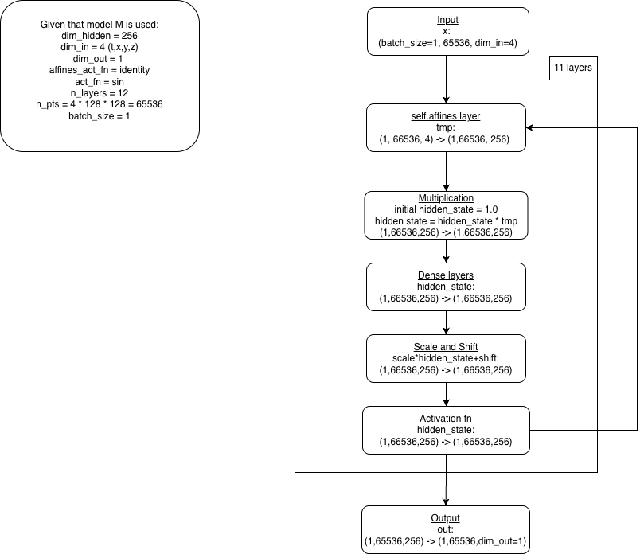

# Summary for Pdeformer-2
Dataset used is PDEFoundry2. Datasets and Pretrained weights can be downloaded from Pdeformer-2's Github.

General pipeline: Load the model -> Generate DAG of data -> Inference

Attributes of DAG: node_type, node_scalar, node_function, in_degree, out_degree, attn_bias, spatial_pos (See pde_dag.py/PDEAsDAG for more info). The shapes of these attributes for DCR/MVDCR have been included in the comments in pdeformer.py/PDEformer/construct

For reference, check the notebooks in this folder. I would also recommend checking Pdeformer-2's Github for their notebooks, as I used them for reference.

## debug.py
Comments have been added about the function of certain code blocks. The primary use of this file is for quick debugging.

## Illustration of INR layers with shape
This is for the prediction of a single component. So, the shapes are the same for DCR/MVDCR in this context, though MVDCR has 2 components.

Model input (pdeformer.py/PDEformer) -> INR layers (poly_inr.py/PolyINR) -> Output/Pred

Dense layers are essentially just linear layers.



For datasets with >= 2 components, see inference.py/inference_pde, particularly this code block:

```python
# multi-component case, inference the rest components (i.e. MVDCR)
    if pde_dag.n_vars > 1:
        pred_all = [pred]
        # iterate over all remaining components
        for idx_var in range(1, pde_dag.n_vars):
            spatial_pos, attn_bias = pde_dag.get_spatial_pos_attn_bias(idx_var) # Both of shape (216,216), this serves as the identifier for variables' idx (See pde_dag.py/PDEAsDAG for more info)
            pred = model(
                as_tensor(pde_dag.node_type), as_tensor(pde_dag.node_scalar),
                as_tensor(pde_dag.node_function), as_tensor(pde_dag.in_degree),
                as_tensor(pde_dag.out_degree), as_tensor(attn_bias),
                as_tensor(spatial_pos), as_tensor(coordinate))
            pred = pred.asnumpy().astype(np.float32)  # [1, n_pts, 1]
            pred_all.append(pred)
        pred = np.concatenate(pred_all, axis=-1)  # [1, n_pts, n_vars], MVDCR: (1,65536,2)
```
